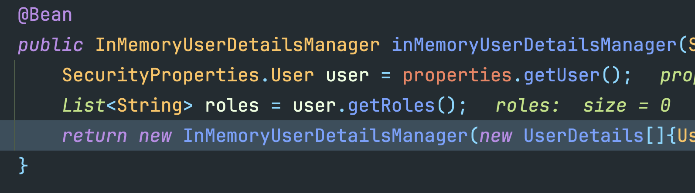

# spring security

## 자동 설정에 의한 기본 보안 작동
- 서버가 기동되면 스프링 시큐리티의 초기화 작업 및 보안 설정이 이루어진다.
- 별도의 설정이나 코드를 따로 작성하지 않아도 기본적인 웹 보안 기능이 현재 시스템에 연동된다.
  - 기본적으로 모든 요청에 대해서 인증 여부 검증 후 승인돼야 자원에 접근이 가능해진다.
  - 별도의 설정을 하지 않으면 폼 로그인, httpBasic 로그인 방식으로 제공된다.
  - 인증을 시도할 수 있는 로그인 페이지가 자동적으로 생성되어 렌더링 된다.
  - 인증 승인이 이루어질 수 있도록 한 개의 계정이 기본적으로 제공되며, 이 값은 **SecurityProperties** 설정 클래스에서 생성한다.
    - username: user
    - password: 랜덤 문자열
  
개발자가 의존성만 추가하고 따로 코드를 추가하지 않으면 제공되는 기본 설정들이다. 이런 일을 해주는 클래스는 **SpringBootWebSecurityConfiguration 클래스다. 즉, 자동 설정에 의한 가장 기본적인 보안 설정을 해주는 클래스다.  

````java
public interface SecurityFilterChain {
    boolean matches(HttpServletRequest request);

    List<Filter> getFilters();
}
```` 

securityFilterChain은 위와 같이 인터페이스다. 그렇다면, 개발자가 재정의 하지 않는다면 어디로 갈까  
SpringBootWebSecurityConfiguration 클래스에 아래와 같이 정의되어 있다.
````java
@Bean
@Order(2147483642)
SecurityFilterChain defaultSecurityFilterChain(HttpSecurity http) throws Exception {
    ((ExpressionUrlAuthorizationConfigurer.AuthorizedUrl)http.authorizeRequests().anyRequest()).authenticated();
    http.formLogin();
    http.httpBasic();
    return (SecurityFilterChain)http.build();
}
````  


그리고, 아이디 비밀번호는 위에서 언급했듯이 SecurityProperties 파일에서 설정하지 않는다면 자동으로 아래와 같이 생성된다.  
````java
public static class User {
        private String name = "user";
        private String password = UUID.randomUUID().toString();
        private List<String> roles = new ArrayList();
        private boolean passwordGenerated = true;

        public User() {
        }

        public String getName() {
            return this.name;
        }

        public void setName(String name) {
            this.name = name;
        }

        public String getPassword() {
            return this.password;
        }

        public void setPassword(String password) {
            if (StringUtils.hasLength(password)) {
                this.passwordGenerated = false;
                this.password = password;
            }
        }

        public List<String> getRoles() {
            return this.roles;
        }

        public void setRoles(List<String> roles) {
            this.roles = new ArrayList(roles);
        }

        public boolean isPasswordGenerated() {
            return this.passwordGenerated;
        }
    }
````
그럼 userName과 password는 어디서 오는지 디버그를 걸고 따라가본다면, 
  

유저 정보를 관리할 수 있는 Bean을 등록하는 과정을 거치는데, 이 과정은 유저정보를 관리할 수 있는 클래스를 만드는것이다.  
기본적으로 사용자에게 제공할 수 있는 user의 name(id)과 비밀번호를 메모리에 저장한다.  


## 초기화 과정
서버를 실행 했을때 기본 보안을 제공하게 되는 과정을 살펴보면, 위에서 보았듯이 SpringBootWebSecurityConfiguration 파일에서 아래 코드가 실행 되는 것이다.
````java
@Configuration(
        proxyBeanMethods = false
)
@ConditionalOnDefaultWebSecurity
static class SecurityFilterChainConfiguration {
  SecurityFilterChainConfiguration() {
  }

  @Bean
  @Order(2147483642)
  SecurityFilterChain defaultSecurityFilterChain(HttpSecurity http) throws Exception {
    http.authorizeHttpRequests((requests) -> {
      ((AuthorizeHttpRequestsConfigurer.AuthorizedUrl)requests.anyRequest()).authenticated();
    });
    http.formLogin(Customizer.withDefaults());
    http.httpBasic(Customizer.withDefaults());
    return (SecurityFilterChain)http.build();
  }
}
````
이 구문이 실행되기 위한 조건, @ConditionalOnDefaultWebSecurity, 또 안에 조건에 따라 실행되는 Conditional로 들어가보면 아래와 같이 작성되어 있다.  

````java
@Target({ElementType.TYPE, ElementType.METHOD})
@Retention(RetentionPolicy.RUNTIME)
@Documented
@Conditional({DefaultWebSecurityCondition.class})
public @interface ConditionalOnDefaultWebSecurity {
}
````
````java
class DefaultWebSecurityCondition extends AllNestedConditions {
    DefaultWebSecurityCondition() {
        super(ConfigurationPhase.REGISTER_BEAN);
    }

    @ConditionalOnMissingBean({SecurityFilterChain.class})
    static class Beans {
        Beans() {
        }
    }

    @ConditionalOnClass({SecurityFilterChain.class, HttpSecurity.class})
    static class Classes {
        Classes() {
        }
    }
}
````
@ConditionalOnMissingBean, ConditionalOnClass 두 가지 조건이 만족되어야 기본 보안 작동이 실행되는것이다.
- @ConditionalOnClass({SecurityFilterChain.class, HttpSecurity.class})
  - 이 조건은 시큐리티에 대한 의존성을 추가 했기 떄문에 만족한다.
- @ConditionalOnMissingBean({SecurityFilterChain.class})
  - @ConditionalOnMissingBean은 빈이 생성되어 있지 않아야 true로 작동된다. 개발자가 따로 SecurityFilterChain 클래스를 따로 정의하지 않으면 이 어노테이션도 true 이다.

### 결론적으로, SecurityFilterChainConfiguration 클래스에 있는 기본 보안이 실행되는 이유는, @ConditionalOnDefaultWebSecurity 어노테이션의 조건에 부합해서 실행이 되는 것이고, 이 조건은 @ConditionalOnMissingBean({SecurityFilterChain.class}) @ConditionalOnClass({SecurityFilterChain.class, HttpSecurity.class}) 두가지 조건을 만족하기 때문에 실행되는것이다.


