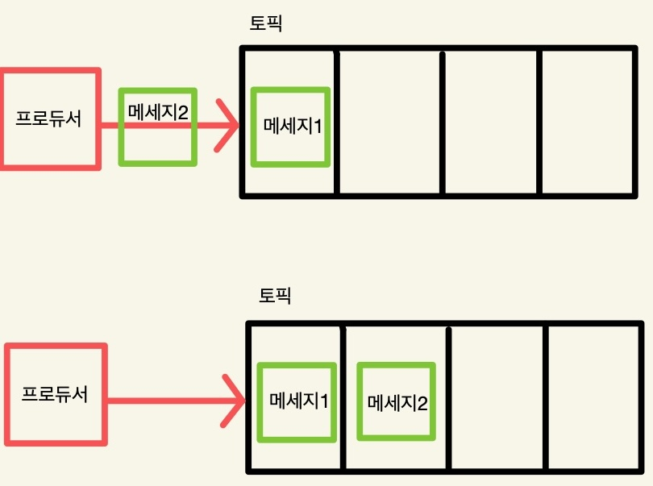
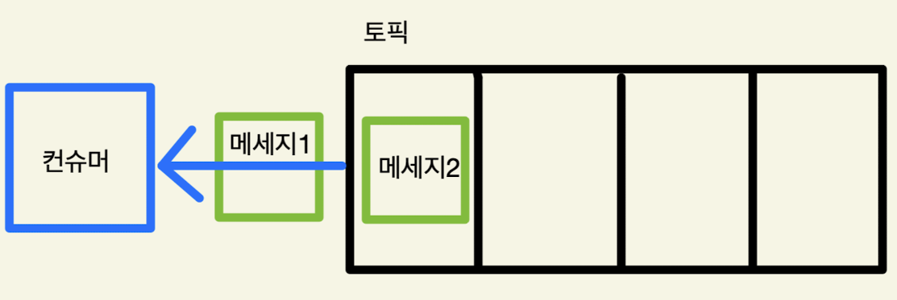
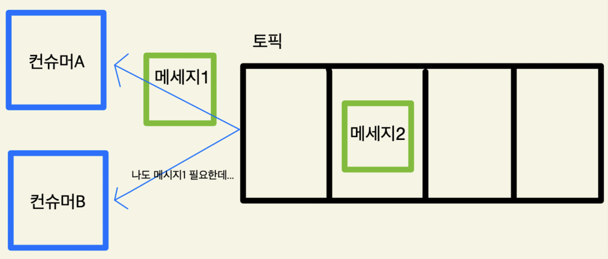
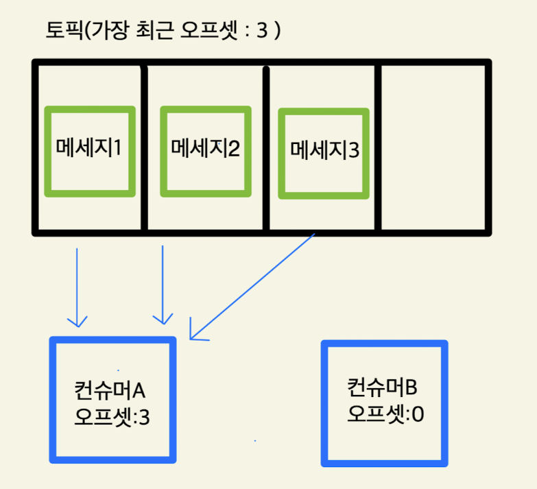
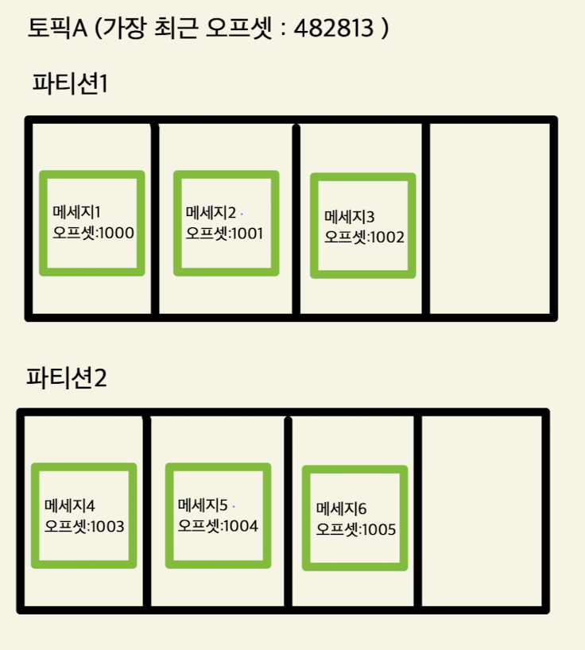
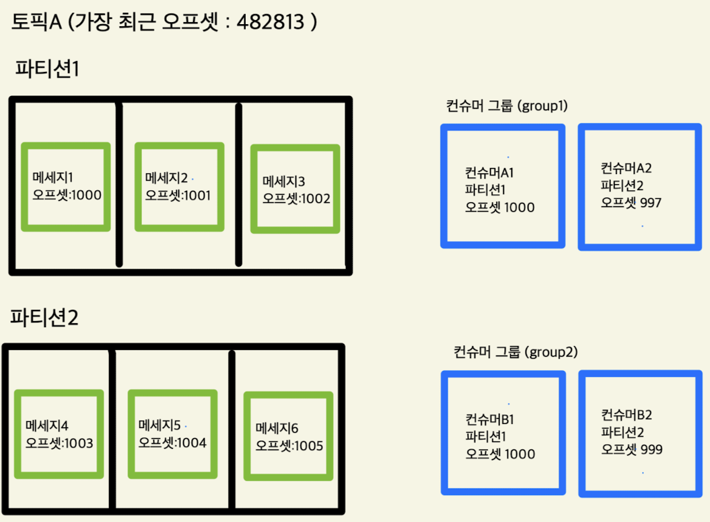
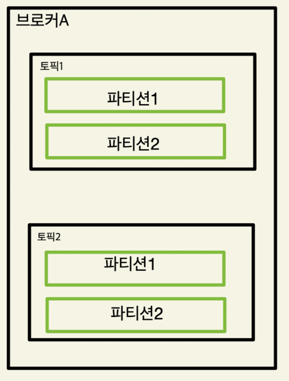
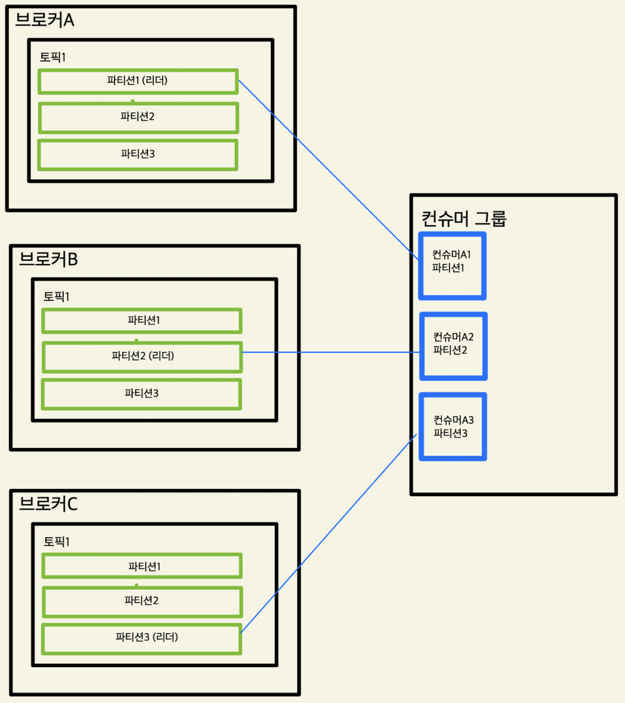

# Kafka
카프카는 아파치 소프트웨어 재단에서 관리하는 오픈 소스 메시지 스트리밍 플랫폼이다.  
- 카프카의 특징은 다음과 같다.  
    - 발행/구독 모델 기반 : 프로듀서는 메시지를 발행하고 컨슈머를 구독하여 메시지를 소비한다.
    - 고성능 : 메시지를 빠르게 처리할 수 있는 고성능 설계
    - 확장성 : 클러스터를 통해 요청 처리량을 늘리거나 데이터 볼륨을 증가
    - 고가용성 : 데이터의 복제본을 여러 서버에 분산 저장한다. 서버 하나가 실패해도 데이터 손실을 방지한다.

## Kafka topic, offset
메세지큐를 만든다고 가정했을때, 데이터를 저장할 공간이 필요하다. 이때 모든 데이터를 하나의 공간에 다 넣을 수 없으므로 이를 구분해서 카테고리 처럼 만들 수 있게 해주는게 topic이다.  

### 메시지와 프로듀서
토픽에 포함되는 데이터를 메시지라고 한다. 메시지는 key와 value, timestamp로 구성되며 메시지가 추가되면 토픽안에 메시지가 저장된다. 이렇게 메시지를 생성해서 topic에 데이터를 저장하는 역할을 하는게 프로듀서(메시지 발행자)이다.
      

### 컨슈머
컨슈머는 토픽을 구독하여 토픽안에 있는 메시지를 읽을 수 있다. 물리적으로 하나의 메시지를 꺼낸다면 가장 처음 추가되었던 메시지1을 읽는다. 큐 구조이기 때문에 FIFO 구조로 되어있다.
    

### 컨슈머 경쟁
만약 위에 상황처럼 물리적으로 메세지를 가져간다고 가정한다면, 두개의 컨슈머가 하나의 토픽에서 메세지를 읽는게 문제가 발생할 수 있다. 컨슈머A,B가 메시지1,2를 둘 다 읽어야 하는 상황인 경우가 그렇다.

이런 상황을 해결할 수 있는게 offset이다. 각 컨슈머와 메세지는 오프셋을 갖고, 컨슈머 오프셋에는 가장 마지막으로 읽은 메세지를 기록하고 메세지의 오프셋은 토픽 내에서 고유한 번호이고 오름차순으로 정렬된다.  

  

오프셋을 증가시키면서 범위 안에 포함된 메세지를 전달한다. 메세지3에 도달하면 컨슈머A는 본인의 오프셋을 3으로 바꾸고 중단하며, 이후 추가적인 메세지가 들어오면 다시 오프셋을 갱신하며 메세지를 읽는다.  
즉, 물리적으로 토픽의 데이터는 건드리지 않는다. 메세지를 참조만하고 오프셋을 갱신하는것이지 토픽의 데이터는 그대로다.   

## 파티션과 브로커

### lag
컨슈머가 메세지를 가져가서 읽는 속도와 토픽에 메세지가 쌓이는 부분에서 속도 차이가 발생하는 것을 **lag** 라고 한다. 이런 lag 수치가 0을 유지하는게 토픽에 쌓인 메세지를 컨슈머가 바로바로 처리한다는 것을 의미하고, 수치가 점점 커진다면 메세지를 처리하고 있지 못하다는 것을 의미한다.
이런 문제를 해결하기 위해 사용하는 것이 파티션이다.

### 파티션
토픽 내부를 여러개로 나누는 것을 의미한다. 하나의 토픽은 1개 이상의 파티션으로 구성되며 파티션은 독립적이기 때문에 파티션1과 파티션2에 각각 다른 컨슈머가 메세지를 처리할 수 있다.  
    

### 파티션과 컨슈머 그룹
나눠진 파티션에 여러 컨슈머가 메세지를 읽을 수 있는데, 하나의 토픽을 바라보고 각각 다른 파티션을 담당하는 컨슈머들의 그룹을 **컨슈머 그룹** 이라고 한다. 여러개의 컨슈머 그룹이 존재할 수 있다.  
      

### 메세지의 순서
토픽이 파티션으로 나뉘어져 있고, 별 다른 설정이 되어 있지 않다면 기본적으로 kafka는 프로듀서가 메세지를 생성해서 저장할 때 라운드 로빈 방식으로 순서대로 추가한다.  
그런데 만약 메세지의 순서가 중요한 상황이라면 라운드 로빈 방식은 큰 문제가 생길 수 있다. 예를 들어 주문의 이벤트를 토픽에 저장하는 경우 주문 완료, 결제 완료 이벤트 등이 발생했을 때 값을 받아서 데이터베이스에 저장해야 하는데 라운드 로빈 방식대로라면 주문 완료, 결제 완료가 다른 파티션에 들어갈 수 있다. 결제 완료 이벤트가 먼저 처리될 수도 있다는 뜻이다.  

이런 상황에서 사용할 수 있는게 메세지에 key를 설정하는 방법이다. Key를 지정해서 같은 파티션에 들어가야 하는 메세지를 지정할 수 있다. 같은 key를 갖는 메세지를 어느 파티션에 넣을지는 라우팅 알고리즘을 사용한다.  

**프로듀서가 어떤 파티션에 들어갈지 지정하는 것이 아니다. 프로듀서는 메세지의 키만 설정하고 나머지의 역할은 카프카가한다.**

## 브로커
토픽과 파티션은 브로커에 제공된다. 브로커는 하나의 물리서버와 일치하며 하나의 브로커는 여러 토픽을 제공할 수 있다.    
    

만약 하나의 브로커만 바라보고 있는 상황에서 브로커에 문제가 생긴다면 메세지큐 역할을 할 수 없게된다. 이런 상황을 막기 위해 클러스터를 구성한다.
    

브로커 A,B,C 는 모두 토픽1을 포함한다. 같은 파티션을 가지고 있지만 각각의 브로커에서 하나의 파티션만 리더로 설정하고, 컨슈머 그룹도 리더 파티션만 바라본다.  
이때, 토픽1의 같은 이름을 갖는 파티션들은 리더가 아니기 때문에 사용하지 않는다고 해도 계속 데이터는 동기화를 진행한다. 그 이유는 브로커1에 문제가 발생한다면 다른 브로커의 파티션이 리더로 선정된다. 브로커1에 파티션1을 바라보고 있던 컨슈머A1은 브로커를 변경해서 다른 브로커에 파티션1에 대한 리더를 바라보게 된다.  

# 개념 정리
- 메세지 : 메세지 큐에 추가되고 읽을 수 있는 데이터
- 토픽 : 메세지를 분류할 수 있는 카테고리 
- 파티션 : 토픽을 세분화하여 병렬처리를 지원하는 단위
- 오프셋 : 각각 메세지는 오프셋을 포함하고 컨슈머는 마지막으로 읽은 오프셋을 저장
- 브로커 : 여러 토픽과 여러 파티션을 포함하는 **서버**
- 클러스터 : 여러 브로커로 구성되어 고가용성을 제공하는 구성요소
- 컨슈머 : 토픽, 파티션으로부터 메세지를 읽어서 처리한다.
- 컨슈머 그룹 : 같은 토픽, 서로 다른 파티션들을 바라보는 컨슈머의 그룹
- 프로듀서 : 토픽, 파티션에 메세지를 추가하는 주체
- 메세지 키 : 메세지들이 같은 파티션에 들어갈 수 있게 설정

